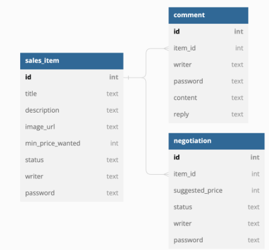

# ♻️멋사마켓 Mini Project

## 프로젝트 소개
🥕당근마켓, 중고나라 등을 착안하여 나만의 중고 제품 거래 플랫폼을 만들어보는 미니 프로젝트로서
사용자가 중고 물품을 자유롭게 올리고, 댓글을 통해 소통하며, 최종적으로 구매 제안에 대하여 
수락할 수 있는 형태의 중고 거래 플랫폼의 백엔드 기능을 구현한 프로젝트이다.

## 개발 환경
* jdk 1.7 
* IDE : IntelliJ IDEA
* Framwork : SpringBoot version '3.1.1'

## 요구 사항

**Day 1**
1. 누구든지 중고 거래를 목적으로 물품에 대한 정보를 등록할 수 있다.
    1. 이때 반드시 포함되어야 하는 내용은 **제목, 설명, 최소 가격, 작성자**이다.
    2. 또한 사용자가 물품을 등록할 때, 비밀번호 항목을 추가해서 등록한다.
    3. 최초로 물품이 등록될 때, 중고 물품의 상태는 **판매중** 상태가 된다.
2. 등록된 물품 정보는 누구든지 열람할 수 있다.
    1. 페이지 단위 조회가 가능하다.
    2. 전체 조회, 단일 조회 모두 가능하다.
3. 등록된 물품 정보는 수정이 가능하다.
    1. 이때, 물품이 등록될 때 추가한 비밀번호를 첨부해야 한다.
4. 등록된 물품 정보에 이미지를 첨부할 수 있다.
    1. 이때, 물품이 등록될 때 추가한 비밀번호를 첨부해야 한다.
    2. 이미지를 관리하는 방법은 자율이다.
5. 등록된 물품 정보는 삭제가 가능하다.
    1. 이때, 물품이 등록될 때 추가한 비밀번호를 첨부해야 한다

**Day 2**
1. 등록된 물품에 대한 질문을 위하여 댓글을 등록할 수 있다.
    1. 이때 반드시 포함되어야 하는 내용은 **대상 물품, 댓글 내용, 작성자**이다.
    2. 또한 댓글을 등록할 때, 비밀번호 항목을 추가해서 등록한다.
2. 등록된 댓글은 누구든지 열람할 수 있다.
    1. 페이지 단위 조회가 가능하다.
3. 등록된 댓글은 수정이 가능하다.
    1. 이때, 댓글이 등록될 때 추가한 비밀번호를 첨부해야 한다.
4. 등록된 댓글은 삭제가 가능하다.
    1. 이때, 댓글이 등록될 때 추가한 비밀번호를 첨부해야 한다.
5. 댓글에는 초기에 비워져 있는 **답글** 항목이 존재한다.
    1. 만약 댓글이 등록된 대상 물품을 등록한 사람일 경우, 물품을 등록할 때 사용한 비밀번호를 첨부할 경우 답글 항목을 수정할 수 있다.
    2. 답글은 댓글에 포함된 공개 정보이다.

**Day 3**
1. 등록된 물품에 대하여 구매 제안을 등록할 수 있다.
    1. 이때 반드시 포함되어야 하는 내용은 **대상 물품, 제안 가격, 작성자**이다.
    2. 또한 구매 제안을 등록할 때, 비밀번호 항목을 추가해서 등록한다.
    3. 구매 제안이 등록될 때, 제안의 상태는 **제안** 상태가 된다.
2. 구매 제안은 대상 물품의 주인과 등록한 사용자만 조회할 수 있다.
    1. 대상 물품의 주인은, 대상 물품을 등록할 때 사용한 **작성자와 비밀번호**를 첨부해야 한다. 이때 물품에 등록된 모든 구매 제안이 확인 가능하다. 페이지 기능을 지원한다.
    2. 등록한 사용자는, 조회를 위해서 자신이 사용한 **작성자와 비밀번호**를 첨부해야 한다. 이때 자신이 등록한 구매 제안만 확인이 가능하다. 페이지 기능을 지원한다.
3. 등록된 제안은 수정이 가능하다.
    1. 이때, 제안이 등록될때 추가한 **작성자와 비밀번호**를 첨부해야 한다.
4. 등록된 제안은 삭제가 가능하다.
    1. 이때, 제안이 등록될때 추가한 **작성자와 비밀번호**를 첨부해야 한다.
5. 대상 물품의 주인은 구매 제안을 수락할 수 있다.
    1. 이를 위해서 제안의 대상 물품을 등록할 때 사용한 **작성자와 비밀번호**를 첨부해야 한다.
    2. 이때 구매 제안의 상태는 **수락**이 된다.
6. 대상 물품의 주인은 구매 제안을 거절할 수 있다.
    1. 이를 위해서 제안의 대상 물품을 등록할 때 사용한 **작성자와 비밀번호**를 첨부해야 한다.
    2. 이때 구매 제안의 상태는 **거절**이 된다.
7. 구매 제안을 등록한 사용자는, 자신이 등록한 제안이 수락 상태일 경우, 구매 확정을 할 수 있다.
    1. 이를 위해서 제안을 등록할 때 사용한 **작성자와 비밀번호**를 첨부해야 한다.
    2. 이때 구매 제안의 상태는 **확정** 상태가 된다.
    3. 구매 제안이 확정될 경우, 대상 물품의 상태는 **판매 완료**가 된다.
    4. 구매 제안이 확정될 경우, 확정되지 않은 다른 구매 제안의 상태는 모두 **거절**이 된다.
## ERD 설계

## 구현
**Day 1**
1. CREATE (@PostMapping)
   1. Request Body를 JSON 형식으로 **제목, 설명, 최소 가격, 작성자**를 받아와 Repository에 등록
   2. 최초로 물품이 등록될 때, 중고 물품의 상태는 **판매중** 상태가 됨.
2. READ Page (@GetMapping)
   1. 등록된 중고 물품의 **id, 제목, ,설명, 최소 가격, 이미지, 상태**를 전체 조회 가능
3. READ (@GetMapping)
   1. 해당하는 ID값을 @PathVariable로 받음.
   2. 해당하는 ID값의 **제목, 설명, 최소 가격, 상태**를 반환
4. UPDATE (@PutMapping)
   1. 해당하는 ID값을 @PathVariable로 받아오고, 해당하는 ID값의 **제목, 설명, 최소 가격, 작성자, 비밀번호**를 Request Body JSON 형식으로 받아옴. 
   2. 데이터 업데이트 하기 전 해당 ID값의 **작성자, 비밀번호**가 일치 하는지 검증을 함.
   3. 검증 후 업데이트
5. UPDATE Image (@PutMapping)
   1. Request Body (Form Data) 형식으로 **이미지, 작성자, 비밀번호**를 받아와 등록
   2. 이미지 업데이트 하기 전 해당 ID값의 **작성자, 비밀번호**가 일치 하는지 검증을 함.
   3. 이미지 형식은 media/{userId}/profile.{파일 확장자}으로 저장됨.
6. DELETE (@DeleteMapping)
   1. 해당하는 ID값을 @PathVariable로 받고, Request Body를 JSON 형식으로 **작성자, 비밀번호**를 받아옴.
   2. 데이터 삭제 하기 전 해당 ID값의 **작성자, 비밀번호**가 일치하는지 검증 후 해당 물품 데이터를 삭제

**Day 2**
1. CREATE (@PostMapping)
   1. 해당하는 item_id값을 @PathVariable로 받고 Request Body를 JSON 형식으로 **대상 물품, 댓글 내용, 작성자**를 받아옴.
   2. 댓글 등록 전 해당하는 **대상 물품**(item_id)이 물품 데이터에 있는지 검증
   3. 검증 후 댓글 등록
2. READ Page (@GetMapping)
   1. 해당하는 item_id값을 @PathVariable로 받음.
   2. 모든 물품에 남겨진 댓글을 **대상 물품, 댓글 내용, 답글**을 페이지로 조회
3. UPDATE (@PutMapping)
   1. 해당하는 commentID(id), item_id값을 @PathVariable로 받고 Request Body를 JSON 형식으로 **작성자, 비밀번호, 댓글 내용**을 받아옴.
   2. 데이터 업데이트 하기 전 해당 ID값의 **작성자, 비밀번호**가 일치 하는지 검증을 함.
4. UPDATE Reply (@PutMapping)
   1. 해당하는 commentID(id), item_id값을 @PathVariable로 받고 Request Body를 JSON 형식으로 **작성자, 비밀번호, 답글**을 받아옴.
   2. 댓글 작성자가 아닌 해당 물품을 올린 **작성자, 비밀번호**가 일치하는지 검증
   3. 검증 후 **답글** 등록
5. DELETE (@DeleteMapping)
   1. 해당하는 commentID(id), item_id값을 @PathVariable로 받고 Request Body를 JSON 형식으로 **작성자, 비밀번호**을 받아옴.
   2. 댓글 작성자의 **작성자, 비밀번호** 데이터가 일치하는지 검증.
   3. 검증 후 댓글 삭제

**Day 3**
1. CREATE (@PostMapping)
   1. 해당하는 item_id값을 @PathVariable로 받고 Request Body를 JSON 형식으로 **작성자, 비밀번호, 제안 가격**을 받아옴.
   2. 제안 등록 전 해당하는 **대상 물품**(item_id)이 물품 데이터에 있는지 검증
   3. 구매 제안이 등록될 때, 제안의 상태는 **제안** 상태가 된다.
2. READ Page (@GetMapping)
   1. 해당하는 item_id값을 @PathVariable로 받고 @RequestParam으로 **작성자, 비밀번호**를 받아옴.
   2. **작성자, 비밀번호**를 입력한 데이터가 Page를 통해 반환해야 하지만 구현 실패
3. UPDATE (@PutMapping)
   1. 해당하는 item_id값, proposalid(id)값을 @PathVariable로 받고 Request Body를 JSON 형식으로 **작성자, 비밀번호, 제안 가격**을 받아옴.
   2. 데이터 업데이트 하기 전 해당 ID값의 **작성자, 비밀번호**가 일치 하는지 또한 물품이 있는지 검증을 함.
4. DELETE (@DeleteMapping)
   1. 해당하는 item_id값, proposalid(id)값을 @PathVariable로 받고 Request Body를 JSON 형식으로 **작성자, 비밀번호, 제안 가격**을 받아옴.
   2. 데이터 삭제 하기 전 해당 ID값의 **작성자, 비밀번호**가 일치 하는지 또한 물품이 있는지 검증을 함.
5. UPDATE Status ("수락"||"거절") (@PutMapping)
   1. 해당하는 item_id값, proposalid(id)값을 @PathVariable로 받고 Request Body를 JSON 형식으로 **작성자, 비밀번호, 수락 or 거절**을 받아옴.
   2. 이때 해당 물품을 올린 판매자의 **작성자, 비밀번호**가 일치하는지 검증
6. UPDATE Status ("확정") (@PutMapping)
   1. 해당하는 item_id값, proposalid(id)값을 @PathVariable로 받고 Request Body를 JSON 형식으로 **작성자, 비밀번호, 확정**을 받아옴.
   2. 이때 해당 물품에서 판매자의 **승인**을 받은 제안만 **확정**을 할 수 있게 검증